Hướng dẫn Cài đặt: JDK20, Elclipse 2023

Tên đề tài: WEBSITE Thương mại điện tử
Tiến độ dự án:
Hoàn thành cơ bản phần quản lý sản phẩm, chức năng bán hàng và thống kê
Tìm hiểu và phát triển một số chức năng mới
Chức năng đã hoạt động:
Quản lý sản phẩm
Quản lý khách hàng
Quản lý đơn hàng
Thống kê doanh thu
Giỏ hàng
Lọc và tìm kiếm các sản phẩm
Thành viên: Vũ Anh Tú ( Project cá nhân)
Thiết kế database
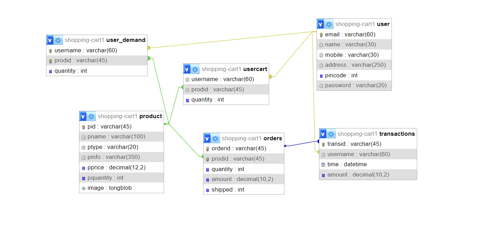

Giao diện DEMO:
Giao diện khi chưa đăng nhập
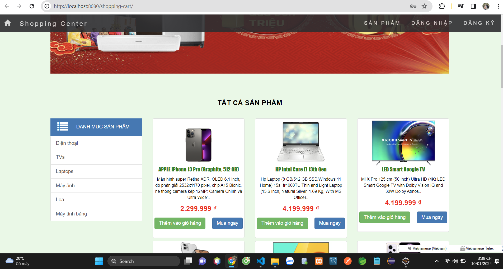
Form đăng ký tài khoản
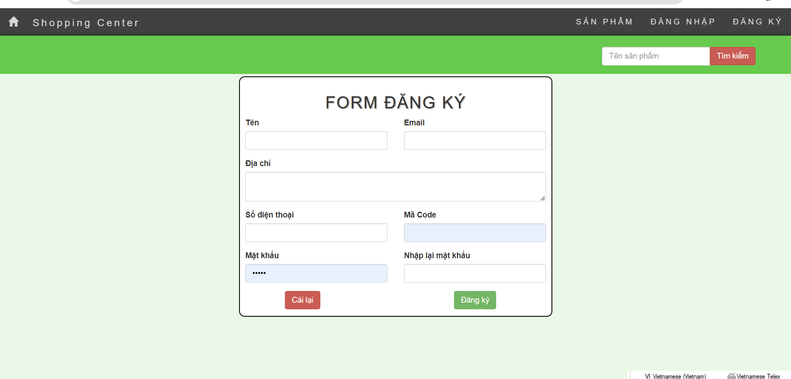
Form đăng nhập
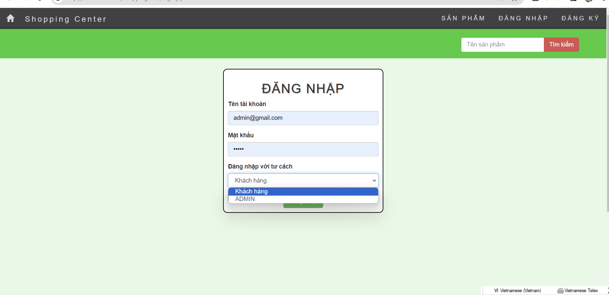
Giao diện chính khi đăng nhập
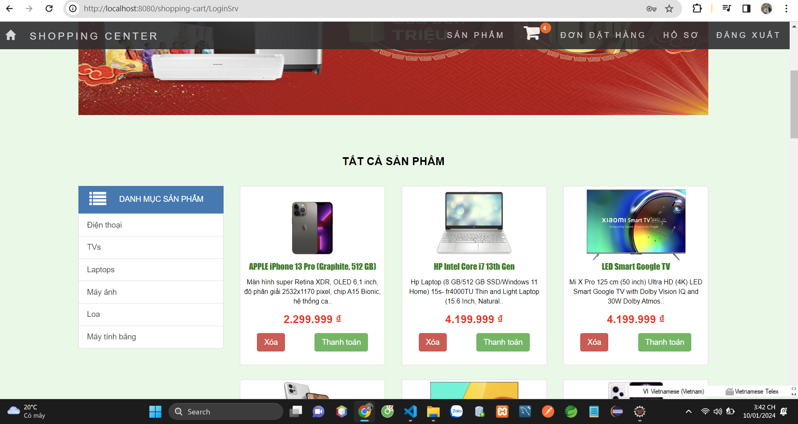
Giao diện giỏ hàng
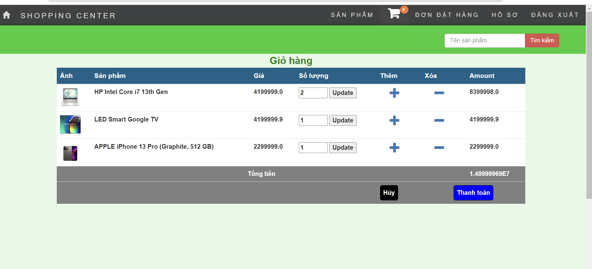
Giao diện profile
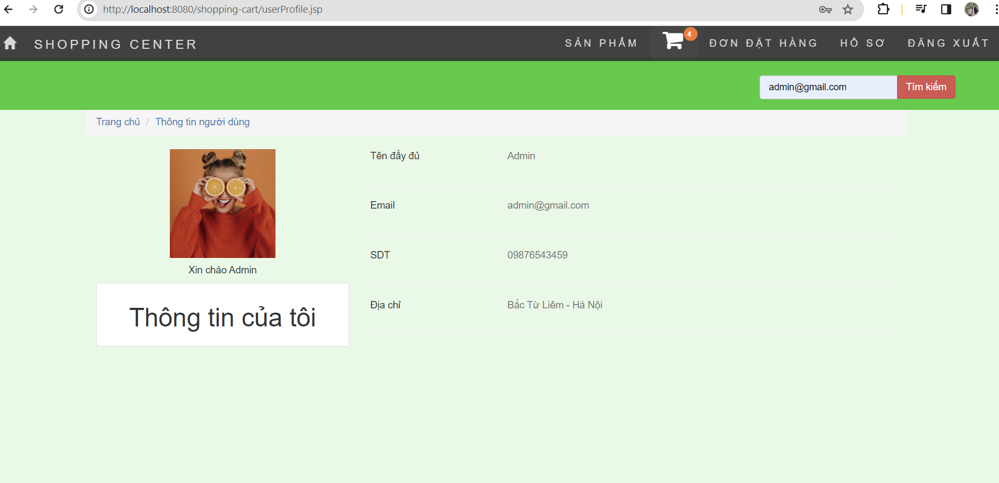
Giao diện phía Admin
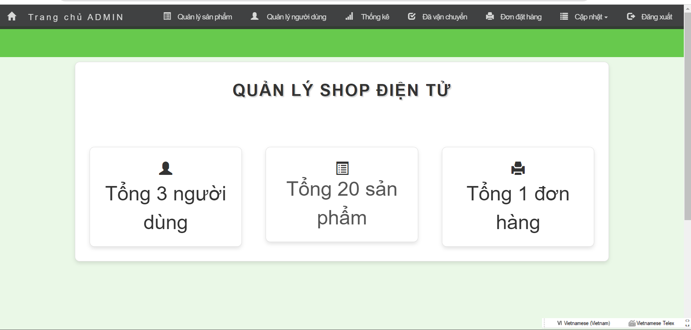
Quản lý sản phẩm
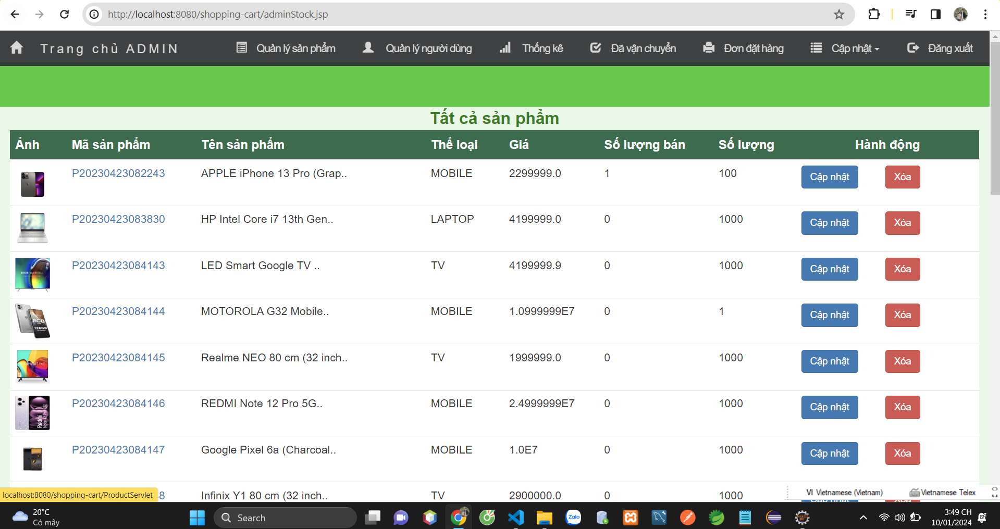
Quản lý người dùng
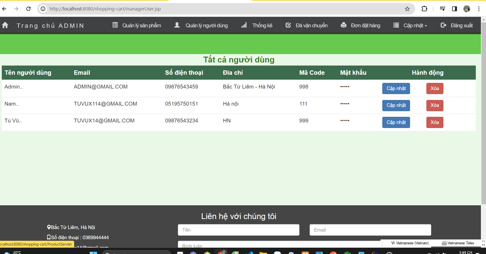
Thống kê doanh thu
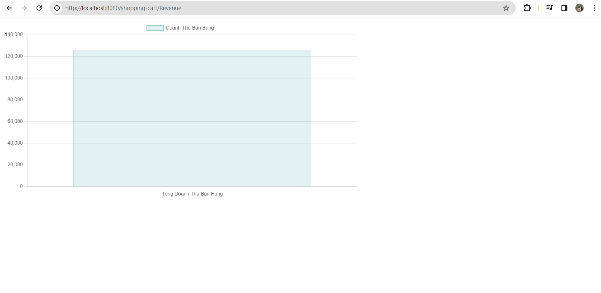
Theo dõi đơn hàng
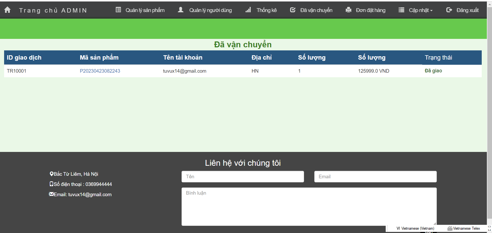
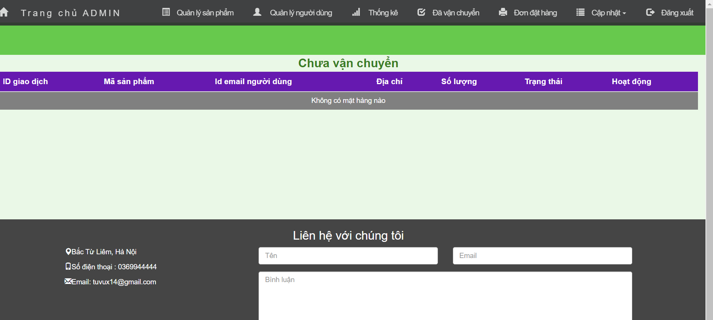

# WE
# WEBSITE_TMDT
